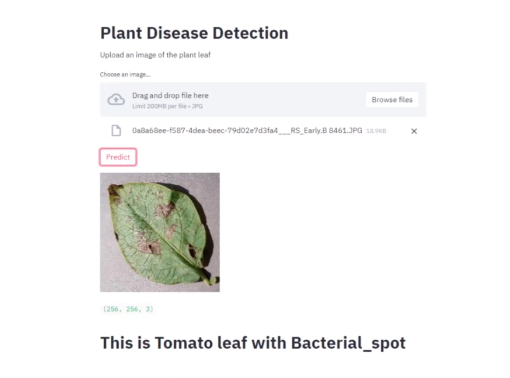

# Plant-Disease-Prediction
 ## to run the file, just go into the folders directory and type streamlit run main_app.py 
 provided you downloaded all the requirements from requirements.txt file :)
 
Here's a project that i built with TensorFlow. The model predicts whether a leaf has some disease or not. It was built using 900 photos of plants with bacterias or some other diseases. Used the 80/20 technique to split training and testing data. Used 50 epochs training which resulted in 98% accuracy. 

I've learned a lot coding this project. I'm completely hooked on OpenCV and TensorFlow as well as ScikitLearn now. Pretty sure i'm gonna improve upon this code in the nearest future.
 
 
 
